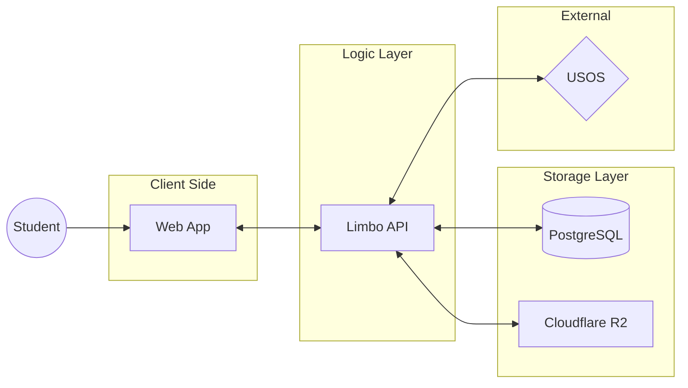

  

     
  

    
    
    

---

Limbo is a collaborative file browser that allows any PW student to upload and access all stored resources. Freedom of information is key.

## Developer stuff

The architecture of Limbo is quitre simple. TODO

### Permissions Table

**Asset** - files and directories

Byte number | Permission
----------- | ----------
1 | View assets
2 | Add assets to approval
4 | Create assets without approval
5 | Rename assets
6 | Delete assets
7 | Interact with files (likes & comments)
8 | Change username
20 | Approve assets
21 | View support tickets
22 | Reply to support tickets
23 | Change other usernames
24 | Delete comments
25 | Modify basic permissions
26 | Modify admin permissions